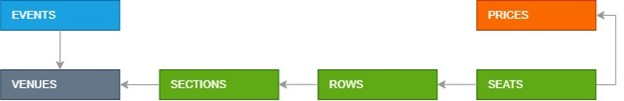

# Domain Vocabulary:
- **Event** – An event is an occurrence in time. In ticketing system, the event acts as a container for both venue (which holds inventory) and meta data about the event itself (name, venue, date, time).
- **Venue** – the place where an event is happening.
- **Manifest** – the seating arrangement applicable to a particular venue (complete seat map).
- **Seat** – the smallest manifest unit that can be purchased or booked. The are two seat types - specific designated place in a row and general admission. General admission means patrons can choose to sit anywhere within a particular section (for example, the dance floor)
- **Offer** – something you can buy and price for it. All seats in the ticketing system need to be sold through an offer. An offer is simply a configuration of properties that tell the system how the tickets should be sold
- **Prices** – Information about the ticket price levels (Adult, Child, VIP, etc.)
- **Ticket** – document (digital or printed), serving as evidence of admission price of some event.  Tickets should include information about the event, the date and time of the event, venue and seats that have been paid for or booked.
- **Customer** – an authenticated user who searches for tickets for an event of interest to him and buys a ticket through an online system
- **Event Manager** – the user of the system who is responsible for administering the event (setting up the manifest, configuring the offer)

# Data Model

# RESTful API

Create Async REST APIs with ASP.NET Core. Use DAL designed in prev module. The following list of the resources should be available
1. Venues
    - GET /venues
    - GET /venues/{venue_id}/sections
        - returns all sections for venue
2. Events
    - GET /events
    - GET /events/{event_id}/sections/{section_id}/seats
        - list of seats (section_id, row_id, seat_id) with seats’ status (id, name) and price options (id, name)
3. Orders
    - GET orders/carts /{cart_id}
        - gets list of items in a cart (cart_id is a uuid, generated and stored the client side)
    - POST orders/carts/{cart_id}
        - takes object of event_id, seat_id and price_id as a payload and adds a seat to the cart. Returns a cart state (with total amount) back to the caller.
    - DELETE orders/carts/{cart_id}/events/{event_id}/seats/{seat_id}
        - deletes a seat for a specific cart
    - PUT orders/carts/{cart_id}/book
        - moves all the seats in the cart to a booked state. Returns a PaymentId.
4. Payments
    - GET payments/{payment_id}
        - Returns the status of a payment
    - POST payments/{payment_id}/complete
        - Updates payment status and moves all the seats related to a payment to the sold state.
    - POST payments/{payment_id}/failed
        - payment status and moves all the seats related to a payment to the available state.
